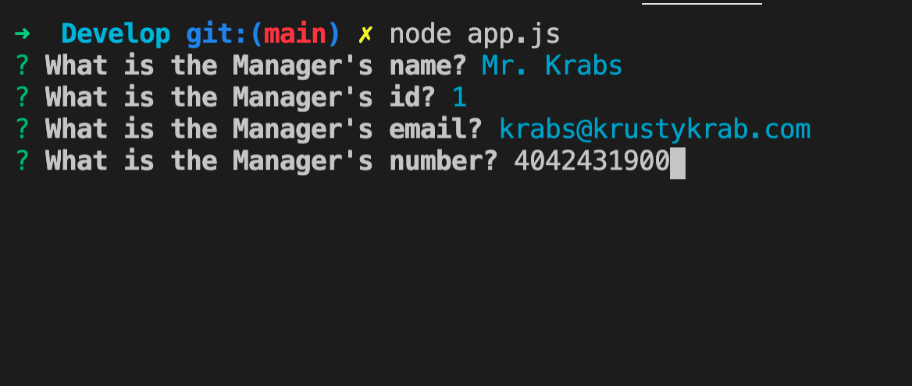

# template-engine-employee-summary

## Description

The purpose of this project was to build a Node CLI that takes in information about employees and generates an HTML webpage that displays summaries for each person. This project also required unit testing.

## Table of Contents
- [Demo](#Demo)
- [Screenshot](#Screenshot)
- [Built With](#Built%20With)
- [License](#License)

## Demo

## Screenshot

## Built With

* JavaScript

## License
[MIT](https://choosealicense.com/licenses/mit/#) License